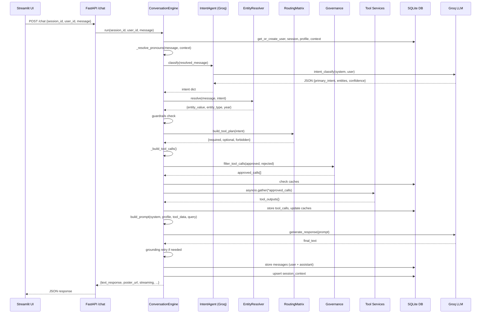

# FilmDB — Backend Architecture Overview

> **Project:** FilmDB - DEMO  
> **Stack:** FastAPI + Groq LLM (Llama 3.3 70B) + SQLAlchemy (SQLite) + External APIs  
> **Generated:** 2026-03-02

---

## Table of Contents

1. [High-Level Architecture](#1-high-level-architecture)
2. [Directory Structure](#2-directory-structure)
3. [Request Lifecycle (End-to-End)](#3-request-lifecycle-end-to-end)
4. [Core Modules](#4-core-modules)
   - 4.1 [API Layer (`main.py`)](#41-api-layer-mainpy)
   - 4.2 [Conversation Engine (`conversation_engine.py`)](#42-conversation-engine-conversation_enginepy)
   - 4.3 [Intent Agent (`intent_agent.py`)](#43-intent-agent-intent_agentpy)
   - 4.4 [Entity Resolver (`entity_resolver.py`)](#44-entity-resolver-entity_resolverpy)
   - 4.5 [Routing Matrix (`routing_matrix.py`)](#45-routing-matrix-routing_matrixpy)
   - 4.6 [Governance (`governance.py`)](#46-governance-governancepy)
   - 4.7 [Guardrails (`guardrails.py`)](#47-guardrails-guardrailspy)
   - 4.8 [Layout Policy (`layout_policy.py`)](#48-layout-policy-layout_policypy)
5. [LLM Client](#5-llm-client)
6. [External Service Layer](#6-external-service-layer)
7. [Database Layer](#7-database-layer)
8. [Caching Strategy](#8-caching-strategy)
9. [Utilities](#9-utilities)
10. [Configuration & Environment](#10-configuration--environment)
11. [Data Flow Diagram](#11-data-flow-diagram)
12. [API Reference](#12-api-reference)
13. [Known Limitations & Notes](#13-known-limitations--notes)

---

## 1. High-Level Architecture

```
┌──────────────────────────────────────────────────────────────────┐
│                      Streamlit Frontend (UI)                     │
│                    POST /chat → JSON response                    │
└────────────────────────────┬─────────────────────────────────────┘
                             │ HTTP
                             ▼
┌──────────────────────────────────────────────────────────────────┐
│                       FastAPI Backend                             │
│  ┌─────────────┐   ┌─────────────────┐   ┌────────────────────┐ │
│  │ Intent Agent │──▶│ Routing Matrix  │──▶│ Tool Governance    │ │
│  │  (Groq LLM) │   │                 │   │ (validate+filter)  │ │
│  └─────────────┘   └─────────────────┘   └────────┬───────────┘ │
│         │                                          │             │
│  ┌──────▼──────┐                          ┌────────▼───────────┐ │
│  │   Entity    │                          │  Tool Execution    │ │
│  │  Resolver   │                          │  (parallel async)  │ │
│  └─────────────┘                          └────────┬───────────┘ │
│                                                    │             │
│  ┌─────────────┐   ┌─────────────────┐   ┌────────▼───────────┐ │
│  │ Guardrails  │   │  Layout Policy  │◀──│  Prompt Builder    │ │
│  │ (block/pass)│   │ (response mode) │   │  + LLM Response    │ │
│  └─────────────┘   └─────────────────┘   └────────────────────┘ │
│                                                                  │
│  ┌──────────────────────────────────────────────────────────────┐│
│  │              SQLite Database (SQLAlchemy ORM)                ││
│  │  users │ sessions │ messages │ tool_calls │ caches           ││
│  └──────────────────────────────────────────────────────────────┘│
└──────────────────────────────────────────────────────────────────┘
                             │
              ┌──────────────┼──────────────┐
              ▼              ▼              ▼
         ┌────────┐    ┌──────────┐   ┌──────────┐
         │  TMDB  │    │Wikipedia │   │  Serper  │
         │  API   │    │  REST    │   │  Search  │
         └────────┘    └──────────┘   └──────────┘
              │              │              │
         ┌────────┐    ┌──────────┐   ┌──────────┐
         │Watchmode│   │RapidAPI  │   │Similarity│
         │  API   │    │Discovery │   │  (TMDB)  │
         └────────┘    └──────────┘   └──────────┘
```

---

## 2. Directory Structure

```
backend/
├── app/
│   ├── main.py                    # FastAPI entry point
│   ├── config.py                  # Settings from .env
│   ├── conversation_engine.py     # Core orchestrator (600+ lines)
│   ├── intent_agent.py            # LLM-based intent classification
│   ├── entity_resolver.py         # Entity extraction & normalization
│   ├── routing_matrix.py          # Intent → tool mapping rules
│   ├── governance.py              # Tool validation & filtering
│   ├── guardrails.py              # Safety & blocking rules
│   ├── layout_policy.py           # Response mode selection
│   │
│   ├── llm/
│   │   └── groq_client.py         # Groq API wrapper (Llama 3.3 70B)
│   │
│   ├── services/                  # External API integrations
│   │   ├── __init__.py
│   │   ├── tmdb_service.py        # Movie metadata + person lookup (PRIMARY)
│   │   ├── imdb_service.py        # IMDb via RapidAPI (DEPRECATED - 403)
│   │   ├── imdb_person_service.py # IMDb person via RapidAPI (DEPRECATED)
│   │   ├── wikipedia_service.py   # Wikipedia REST API summaries
│   │   ├── watchmode_service.py   # Streaming availability by region
│   │   ├── similarity_service.py  # Similar movies (TMDB + RapidAPI)
│   │   ├── web_search_service.py  # Google search via Serper API
│   │   ├── discovery_engine_service.py  # Trending/Top-Rated/Upcoming
│   │   ├── rt_reviews_service.py  # Rotten Tomatoes reviews
│   │   └── archive_service.py     # Public domain downloads
│   │
│   ├── db/
│   │   ├── models.py              # SQLAlchemy ORM models
│   │   ├── session_store.py       # CRUD for users, sessions, messages
│   │   └── cache_layer.py         # Movie/streaming/similarity caches
│   │
│   └── utils/
│       ├── prompt_builder.py      # Assembles final LLM prompt
│       └── tool_formatter.py      # Summarizes tool outputs for LLM
│
├── .env                           # API keys and configuration
└── FilmDB_Demo.db                 # SQLite database file
```

---

## 3. Request Lifecycle (End-to-End)

When a user sends a message through the Streamlit UI, the following pipeline executes:

```
User Message
    │
    ▼
┌─ 1. PRONOUN RESOLUTION ──────────────────────────────────────┐
│  If message contains "it", "him", "that movie" etc.,         │
│  append "(refers to {last_movie/person})" from session ctx   │
└──────────────────────────────────────────────────────────────┘
    │
    ▼
┌─ 2. INTENT CLASSIFICATION ───────────────────────────────────┐
│  IntentAgent calls Groq LLM with strict JSON schema          │
│  Returns: primary_intent, secondary_intents, entities,       │
│           confidence (0-100)                                 │
│  Fast-path: common greetings bypass LLM entirely             │
│  Overrides: Award/Download keywords force intent change      │
└──────────────────────────────────────────────────────────────┘
    │
    ▼
┌─ 3. ENTITY RESOLUTION ──────────────────────────────────────┐
│  Extract movie/person name from entities or raw message      │
│  Strip filler phrases ("plot summary of", "tell me about")   │
│  Alias mapping: "godfather" → "The Godfather"               │
│  Fuzzy matching via difflib for typo tolerance               │
│  Determine entity_type: movie, person, award_event, catalog │
└──────────────────────────────────────────────────────────────┘
    │
    ▼
┌─ 4. GUARDRAILS CHECK ───────────────────────────────────────┐
│  Block if: illegal download intent, pronoun-only w/o context│
│  If blocked → return CLARIFICATION response immediately     │
└──────────────────────────────────────────────────────────────┘
    │
    ▼
┌─ 5. GREETING FAST-PATH ─────────────────────────────────────┐
│  If intent = GREETING → LLM generates greeting              │
│  No tools executed, just a warm response                     │
└──────────────────────────────────────────────────────────────┘
    │
    ▼
┌─ 6. ROUTING MATRIX ─────────────────────────────────────────┐
│  Maps intent → required + optional + forbidden tools         │
│  Example: ENTITY_LOOKUP → required:[imdb]                   │
│                            optional:[wikipedia, watchmode]   │
│  Low confidence (<60) → adds web_search as safety net       │
└──────────────────────────────────────────────────────────────┘
    │
    ▼
┌─ 7. TOOL CALL CONSTRUCTION ─────────────────────────────────┐
│  _build_tool_calls() maps each tool name to its arguments:  │
│    imdb, wikipedia, similarity → {title: entity_value}      │
│    watchmode → {title, region}                               │
│    web_search → {query: original_message}                    │
│    imdb_person → {name: person_name}                        │
│    imdb_upcoming → {country: user_region}                   │
│  Download policy: add/remove archive tool based on year     │
└──────────────────────────────────────────────────────────────┘
    │
    ▼
┌─ 8. GOVERNANCE (VALIDATION & FILTERING) ────────────────────┐
│  For each tool call:                                         │
│    ✓ Tool name must be in TOOL_REGISTRY                     │
│    ✓ Required arguments must be present                     │
│    ✓ No duplicates                                          │
│    ✓ Max 4 tools per request                                │
│  Outputs: approved_calls + rejected_calls                   │
└──────────────────────────────────────────────────────────────┘
    │
    ▼
┌─ 9. TOOL EXECUTION (ASYNC PARALLEL) ────────────────────────┐
│  a) Check caches first (metadata, streaming, similarity)    │
│  b) Pre-fetch for similarity: get imdb_id from TMDB first   │
│  c) Dispatch remaining tools via asyncio.gather()            │
│  d) Store execution logs (tool_calls table)                 │
│  e) Update caches with fresh results                        │
└──────────────────────────────────────────────────────────────┘
    │
    ▼
┌─ 10. PROMPT ASSEMBLY ───────────────────────────────────────┐
│  build_prompt() constructs final LLM prompt with:           │
│    SYSTEM: FilmDB instructions + response rules             │
│    USER PROFILE: region, platforms, genres (if available)    │
│    TOOL DATA: [TOOL_DATA] summaries [/TOOL_DATA]            │
│    USER QUERY: the original message                         │
└──────────────────────────────────────────────────────────────┘
    │
    ▼
┌─ 11. LLM RESPONSE GENERATION ───────────────────────────────┐
│  Groq LLM generates final natural language response          │
│  Grounding retry: if rating/year from TMDB is missing        │
│  from response text, re-prompt with STRICT GROUNDING         │
└──────────────────────────────────────────────────────────────┘
    │
    ▼
┌─ 12. RESPONSE CONSTRUCTION ─────────────────────────────────┐
│  Layout policy selects response_mode:                        │
│    FULL_CARD, MINIMAL_CARD, EXPLANATION_ONLY,               │
│    AVAILABILITY_FOCUS, RECOMMENDATION_GRID,                 │
│    EXPLANATION_PLUS_AVAILABILITY                            │
│  Build structured response with:                            │
│    text_response, poster_url, streaming[], recommendations[]│
│    download_link, sources[], response_mode                   │
│  Store user + assistant messages in DB                       │
│  Update session context (last_movie, last_person, etc.)     │
└──────────────────────────────────────────────────────────────┘
    │
    ▼
  JSON Response → Streamlit Frontend
```

---

## 4. Core Modules

### 4.1 API Layer (`main.py`)

**Role:** FastAPI entry point. Minimal — just one endpoint.

| Endpoint | Method | Request Body | Response |
|----------|--------|-------------|----------|
| `/chat` | POST | `{session_id, user_id, message}` | `{text_response, poster_url, streaming[], recommendations[], download_link, sources[], response_mode}` |

- Initializes the database on startup via `init_db()`
- Instantiates a single `ConversationEngine` shared across all requests

---

### 4.2 Conversation Engine (`conversation_engine.py`)

**Role:** Central orchestrator. The "brain" that coordinates all other modules.

**Key Methods:**

| Method | Purpose |
|--------|---------|
| `run()` | Public entry — delegates to `_run_internal()` |
| `run_with_trace()` | Same as `run()` but also returns a debug trace dict |
| `_run_internal()` | Full pipeline execution (steps 1-12 above) |
| `_resolve_pronouns()` | Replaces "it", "him" with last known entity from session |
| `_build_tool_calls()` | Maps tool names → argument dicts using resolved entities |
| `_execute_tools()` | Parallel async execution with caching |
| `_dispatch_tool()` | Routes a tool name to the correct service function |
| `_build_response()` | Assembles the final structured JSON response |
| `_needs_grounding_retry()` | Checks if LLM ignored tool data (rating/year missing) |
| `_apply_award_override()` | Forces AWARD_LOOKUP intent for oscar-related keywords |
| `_apply_download_override()` | Forces DOWNLOAD intent for "download" keywords |
| `_apply_download_policy()` | Adds/removes archive tool based on public domain status |

**System Instructions (embedded in file):**
```
- NEVER start with "Introduction to..."
- Use tool data as factual ground truth
- Do not fabricate streaming, rating, or download data
- Structure responses with headings and bullet points
```

---

### 4.3 Intent Agent (`intent_agent.py`)

**Role:** Classifies user intent using Groq LLM with strict JSON output.

**Supported Intents (17 total):**

| Intent | Example Query | Tools Triggered |
|--------|--------------|-----------------|
| `GREETING` | "Hello" | None (fast path) |
| `ENTITY_LOOKUP` | "Tell me about Inception" | imdb, wikipedia, watchmode |
| `PERSON_LOOKUP` | "Who is Nolan?" | imdb_person, wikipedia |
| `ANALYTICAL_EXPLANATION` | "Why is Kubrick great?" | imdb, wikipedia, web_search |
| `STREAMING_AVAILABILITY` | "Where to watch Batman?" | watchmode, web_search |
| `RECOMMENDATION` | "Movies like Interstellar" | similarity, imdb |
| `TRENDING` | "Trending movies" | imdb_trending_tamil, web_search |
| `TOP_RATED` | "Top rated films" | imdb_top_rated_english |
| `UPCOMING` | "Upcoming releases" | imdb_upcoming |
| `REVIEWS` | "Reviews of Oppenheimer" | rt_reviews, imdb |
| `AWARD_LOOKUP` | "Oscar 2026 nominations" | web_search, wikipedia |
| `DOWNLOAD` | "Download Godfather" | watchmode (legal redirect) |
| `LEGAL_DOWNLOAD` | "Legal download of Nosferatu" | watchmode + archive (if pre-1928) |
| `ILLEGAL_DOWNLOAD_REQUEST` | "Torrent link for..." | **BLOCKED** |
| `COMPARISON` | "Batman vs Superman" | web_search, imdb, wikipedia |
| `STREAMING_DISCOVERY` | "What's new on Netflix?" | web_search |
| `GENERAL_CONVERSATION` | "What makes a great film?" | web_search, wikipedia |

**Optimizations:**
- Common greetings ("hi", "hello", "hey", etc.) are detected locally without an LLM call
- Confidence is clamped to ≥50 for valid intents

---

### 4.4 Entity Resolver (`entity_resolver.py`)

**Role:** Extracts and normalizes movie/person names from raw user messages.

**Key Features:**
- **Filler phrase stripping:** 11 regex patterns remove noise like "tell me about", "plot summary of", "where can I stream", "movies similar to", etc.
- **Alias mapping:** Handles common misspellings (`"godfather"` → `"The Godfather"`, `"shawshank"` → `"The Shawshank Redemption"`)
- **Fuzzy matching:** Uses `difflib.get_close_matches` with 0.88 cutoff for typo tolerance
- **Public domain detection:** Year < 1928 flags content as public domain
- **Entity type inference:** Determines if the entity is a movie, person, award_event, or catalog based on intent + keyword analysis

---

### 4.5 Routing Matrix (`routing_matrix.py`)

**Role:** Static rule-based mapping from intent → which tools to call.

Each intent maps to three tool lists:
- **required:** Always called for this intent
- **optional:** Called if planner suggests them
- **forbidden:** Never called for this intent (e.g., `archive` blocked for most intents)

Low-confidence intents (<60) automatically add `web_search` as a safety net.

---

### 4.6 Governance (`governance.py`)

**Role:** Validates and filters tool calls before execution.

**Checks performed:**
1. Tool name must exist in `TOOL_REGISTRY` (11 registered tools)
2. All required arguments must be present and non-empty
3. No duplicate tool calls (dedup by name + arguments)
4. Maximum 4 tools per request

**Tool Registry:**

| Tool Name | Required Args | Description |
|-----------|--------------|-------------|
| `imdb` | `title` | Movie metadata, ratings, cast (via TMDB) |
| `wikipedia` | `title` | Overview, biography, historical context |
| `watchmode` | `title` | Streaming availability by region |
| `similarity` | `title` | Content-based movie recommendations |
| `archive` | `title` | Legal public domain download links |
| `web_search` | `query` | General web search via Serper |
| `imdb_trending_tamil` | — | Trending Tamil movies list |
| `imdb_top_rated_english` | — | Top rated English movies list |
| `imdb_upcoming` | — | Upcoming releases by country |
| `imdb_person` | `name` | Person profile + filmography (via TMDB) |
| `rt_reviews` | `title` | Rotten Tomatoes critic reviews |

---

### 4.7 Guardrails (`guardrails.py`)

**Role:** Pre-execution safety checks. Blocks harmful or ambiguous queries.

**Rules:**
- `ILLEGAL_DOWNLOAD_REQUEST` → blocked with legal streaming redirect
- Pronoun-only queries without session context → blocked with clarification request
- Empty intent → blocked with "couldn't determine intent" message

---

### 4.8 Layout Policy (`layout_policy.py`)

**Role:** Determines the UI response mode based on intent + available tool data.

**Response Modes:**

| Mode | When Used | UI Behavior |
|------|-----------|-------------|
| `FULL_CARD` | ENTITY_LOOKUP with TMDB data | Poster + details + streaming |
| `MINIMAL_CARD` | DOWNLOAD without archive data | Text only |
| `EXPLANATION_ONLY` | Analytical queries, greetings | Rich text response |
| `EXPLANATION_PLUS_AVAILABILITY` | Explanation + streaming data available | Text + streaming buttons |
| `AVAILABILITY_FOCUS` | Streaming queries | Platform list prominently shown |
| `RECOMMENDATION_GRID` | Recommendations, trending, top rated | Grid of movie cards |

---

## 5. LLM Client

**File:** `llm/groq_client.py`  
**Provider:** Groq Cloud  
**Model:** `llama-3.3-70b-versatile` (configurable via `GROQ_MODEL` env var)

**Three LLM call types:**

| Method | Temperature | Purpose |
|--------|------------|---------|
| `intent_classify()` | 0.2 | Strict JSON intent classification |
| `propose_tools()` | 0.2 | Tool proposal (currently unused — routing matrix handles this) |
| `generate_response()` | 0.4 | Final natural language response |

**Error Handling:** All LLM calls are wrapped in try/except → returns empty string on failure.

---

## 6. External Service Layer

All services are in `app/services/` and follow a consistent pattern:
- Async functions using `httpx.AsyncClient`
- Return `normalize_tool_output(status, data)` → `{"status": "success"|"not_found"|"error", "data": {...}}`
- Retry logic (2 retries) on timeout/5xx errors

### Service Details

| Service | API Provider | Key Endpoints | Data Returned |
|---------|-------------|---------------|---------------|
| **`tmdb_service`** (PRIMARY) | TMDB v3 | `/search/movie`, `/movie/{id}`, `/search/person`, `/person/{id}` | Title, year, rating, cast, director, plot, poster, genres, runtime, IMDb ID, biography, filmography |
| **`wikipedia_service`** | Wikipedia REST | `/page/summary/{title}` | Title, summary, thumbnail |
| **`watchmode_service`** | Watchmode | `/v1/search/`, `/v1/title/{id}/sources/` | Streaming platforms by region |
| **`similarity_service`** | TMDB + RapidAPI | `/movie/{id}/similar` | List of similar movie titles |
| **`web_search_service`** | Serper (Google) | `google.serper.dev/search` | Search summary + top 5 source links |
| **`discovery_engine_service`** | RapidAPI (imdb236) | Trending Tamil, Top Rated English, Upcoming | Lists of movies with titles, years, ratings |
| **`rt_reviews_service`** | RapidAPI (RT) | Rotten Tomatoes reviews | Sentiment, score |
| **`archive_service`** | Internet Archive | Public domain lookup | Download link |

### Service Deprecation Notes

| Service | Status | Reason |
|---------|--------|--------|
| `imdb_service.py` | ⚠️ DEPRECATED | `imdb8.p.rapidapi.com` returns 403 (subscription expired) |
| `imdb_person_service.py` | ⚠️ DEPRECATED | Same RapidAPI key issue |

Both are replaced by `tmdb_service.py` in the `_dispatch_tool()` routing — the tool names `"imdb"` and `"imdb_person"` still exist in the routing matrix but dispatch to TMDB.

---

## 7. Database Layer

**ORM:** SQLAlchemy with SQLite (`FilmDB_Demo.db`)  
**File:** `db/models.py` (ORM models) + `db/session_store.py` (CRUD operations)

### Tables

| Table | Primary Key | Purpose | Key Columns |
|-------|------------|---------|-------------|
| `users` | `id` (UUID) | User accounts | `created_at`, `updated_at` |
| `user_profiles` | `user_id` (FK) | Preferences/personalization | `region`, `subscribed_platforms`, `favorite_genres`, `favorite_movies`, `response_style` |
| `sessions` | `id` (UUID) | Chat sessions | `user_id`, `title`, timestamps |
| `messages` | `id` (UUID) | Chat message log | `session_id`, `role`, `content`, `token_count` |
| `tool_calls` | `id` (UUID) | Tool execution audit log | `session_id`, `tool_name`, `request_payload`, `response_status`, `execution_time_ms` |
| `session_context` | `session_id` | Active context for pronoun resolution | `last_movie`, `last_person`, `last_entity`, `entity_type`, `last_intent` |
| `movie_metadata_cache` | `title` | TMDB/IMDb data cache (24h TTL) | `imdb_data`, `wikipedia_data` |
| `streaming_cache` | `title` + `region` | Watchmode data cache (24h TTL) | `streaming_data` |
| `similarity_cache` | `title` | Similar movies cache (30-day TTL) | `recommendations` |
| `query_analytics` | `id` (UUID) | Query-level analytics | `user_id`, `tools_used`, `response_time_ms` |

### CRUD Operations (`session_store.py`)

| Function | Purpose |
|----------|---------|
| `get_or_create_user()` | Idempotent user creation |
| `get_or_create_session()` | Idempotent session creation |
| `fetch_last_messages()` | Last N messages for conversation context |
| `store_message()` | Persist user/assistant messages |
| `store_tool_call()` | Audit log for every tool execution |
| `get_user_profile()` | Fetch user preferences |
| `get_session_context()` | Get last movie/person/intent for pronoun resolution |
| `upsert_session_context()` | Update session context after each request |

---

## 8. Caching Strategy

**File:** `db/cache_layer.py`

Three separate caches with different TTLs:

| Cache | TTL | Key | Stores |
|-------|-----|-----|--------|
| **Metadata** | 24 hours | movie title | TMDB data + Wikipedia summary |
| **Streaming** | 24 hours | title + region | Platform availability |
| **Similarity** | 30 days | movie title | Recommendation list |

**Cache Flow:**
```
Request → Check Cache → Cache Hit?
                          ├── Yes → Use cached data (skip API call)
                          └── No  → Call API → Store in cache → Use result
```

Caches are stored in SQLite alongside the main data (no external Redis/Memcached).

---

## 9. Utilities

### `prompt_builder.py`

Assembles the final prompt sent to the LLM by concatenating:

```
SYSTEM:
  [FilmDB system instructions]

USER PROFILE:
  - region: India
  - subscribed_platforms: Netflix, Hotstar

TOOL DATA:
  [TOOL_DATA] source: imdb title: The Godfather year: 1972 rating: 8.7 | ... [/TOOL_DATA]
  [TOOL_DATA] source: wikipedia summary: The Godfather is a 1972 crime film... [/TOOL_DATA]

USER QUERY:
  Tell me about The Godfather
```

### `tool_formatter.py`

Converts raw tool output dicts into human-readable summaries for the LLM:

| Tool | Summary Format |
|------|---------------|
| `imdb` | `source: imdb title: X year: Y rating: Z \| director: A \| cast: B, C \| genres: D \| plot: E` |
| `wikipedia` | `source: wikipedia summary: [first 180 chars]` |
| `watchmode` | `source: watchmode platforms: Netflix, Hotstar` |
| `similarity` | `source: similarity recommendations: Film1, Film2` |
| `web_search` | `source: web_search summary: [first 180 chars]` |
| `imdb_person` | `source: imdb_person name: X profession: Y` |

---

## 10. Configuration & Environment

**File:** `config.py` — Loads all settings from `.env`

| Variable | Default | Purpose |
|----------|---------|---------|
| `GROQ_API_KEY` | — | LLM provider API key |
| `GROQ_MODEL` | `llama-3.3-70b-versatile` | LLM model name |
| `DATABASE_URL` | `sqlite:///./FilmDB_Demo.db` | Database connection |
| `TMDB_API_KEY` | — | The Movie Database (primary movie data) |
| `RAPIDAPI_KEY` | — | RapidAPI key (discovery, similarity) |
| `IMDB236_HOST` | `imdb236.p.rapidapi.com` | Discovery engine host |
| `WATCHMODE_API_KEY` | — | Streaming availability |
| `SERPER_API_KEY` | — | Google search via Serper |
| `HTTP_TIMEOUT_SECONDS` | `15` | Global HTTP timeout for all services |

---

## 11. Data Flow Diagram



---

## 12. API Reference

### `POST /chat`

**Request:**
```json
{
  "session_id": "uuid-string",
  "user_id": "username",
  "message": "Tell me about The Piano Teacher"
}
```

**Response:**
```json
{
  "text_response": "## Movie Overview\nThe Piano Teacher is a 2001 drama...",
  "poster_url": "https://image.tmdb.org/t/p/w500/abc.jpg",
  "streaming": ["Netflix", "Hotstar"],
  "recommendations": ["Amour", "Caché", "The White Ribbon"],
  "download_link": "",
  "sources": [
    {"title": "The Piano Teacher (2001)", "link": "https://imdb.com/..."},
    {"title": "Wikipedia", "link": "https://en.wikipedia.org/..."}
  ],
  "response_mode": "FULL_CARD"
}
```

---

## 13. Known Limitations & Notes

### Current Limitations
- **IMDb RapidAPI:** Both `imdb8` and `imdb236` hosts are non-functional (403 / garbage search results). All movie lookups now go through TMDB.
- **No conversation memory in final prompt:** `recent_messages` is always passed as `[]` to the prompt builder. Session context is only used for pronoun resolution, not true multi-turn conversation.
- **Single endpoint:** No separate endpoints for user management, session history, or analytics.
- **No streaming responses:** The LLM generates the entire response before returning it (no SSE/WebSocket streaming).

### Design Decisions
- **Tool names are decoupled from services:** The routing matrix uses logical names like `"imdb"` which dispatch to `tmdb_service.run()` — this allows swapping data sources without changing the intent/routing layer.
- **Parallel tool execution:** All approved tools run concurrently via `asyncio.gather()`, reducing latency.
- **Grounding retry:** If the LLM ignores tool data (e.g., omits the rating), the engine re-prompts with a stricter instruction.
- **SQLite for everything:** Caches, sessions, analytics, and user data all live in one SQLite file for zero-infrastructure deployment.
